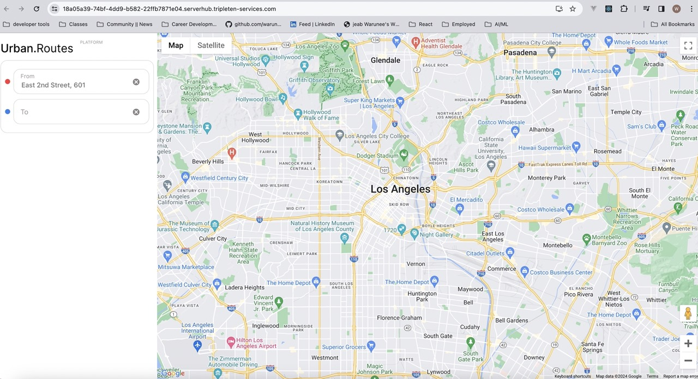

# 🚕 Urban Routes QA Testing & Automation Project



## 📖 Overview

The **Urban Routes Web Application** is a route-building platform that calculates travel time and cost across multiple transportation modes.

This project combines:

* 🧪 **Manual QA Testing (Project 3)** – UI, functionality, and defect reporting
* 🤖 **Python Automation (Project 7)** – scalable test framework design

The goal is to demonstrate both **strong QA fundamentals** and **automation-ready thinking** in a real-world application. 

---

## 🎯 Objectives

* Validate **core functionality (route, booking, pricing)**
* **UI Validation** (Figma)
* Design **robust test cases using QA techniques**
* Identify and document **critical defects**
* Build a **modular Python test framework**
* Prepare for **future Selenium automation**

Figure: Mind map used to identify edge cases and system flow*

---

## 🧠 Requirement Analysis

To better understand the application flow and identify edge cases, I created a mind map to visualize features, logic, and user paths.


---

# 🧠 Part 1: Manual QA Testing

## 🔍 Testing Scope

* Route calculation (time & cost)
* Travel modes (Optimal, Fastest, Custom)
* Transportation types
* Carsharing & Aerotaxi features
* Booking flow & payment validation

---

## 🧪 Testing Approach

* Equivalence Partitioning
* Boundary Value Analysis
* Positive & Negative Testing
* Cross-browser testing (Chrome, Firefox)

---

## 🐞 Bug Report Summary

* **Total Bugs Found:** 42
* Managed using **Jira**

---

## 📊 Bug Severity Distribution

| Severity  | Count | Description                                                         |
| --------- | ----- | ------------------------------------------------------------------- |
| 🔴 High   | 12    | Core functionality broken (booking failure, incorrect calculations) |
| 🟠 Medium | 18    | UI inconsistencies, validation issues                               |
| 🟢 Low    | 12    | Minor UI/UX issues                                                  |

**Total Bugs Identified:** 42

---

## 🎯 Top 5 Critical Bugs Identified

### 1. 🚨 Incorrect Travel Cost Calculation

* Cost did not match pricing algorithm
* Impact: Users may make incorrect booking decisions
* Severity: 🔴 High

---

### 2. 🚨 Booking Flow Failure

* "Book" button failed under certain conditions
* Impact: Users unable to complete booking
* Severity: 🔴 High

---

### 3. 🚨 Missing Payment Validation

* Invalid card details were accepted
* Impact: Risk of failed transactions
* Severity: 🔴 High

---

### 4. ⚠️ Cross-Browser Layout Issues

* UI misalignment in Firefox
* Impact: Inconsistent UX
* Severity: 🟠 Medium

---

### 5. ⚠️ Missing Error Handling

* No feedback for invalid inputs
* Impact: Confusing user experience
* Severity: 🟠 Medium

---

## 🧾 Example Bug Report (Jira)

**Title:** The order can’t be canceled during the free waiting time period.

**Description**
When click “x Cancel” button to cancel the order during the free waiting time period the system doesn’t responded.

**Preconditions**
1. Launch app 
2. Enter "1917 Bay St" in the "From" field 
3. Enter "615 S Broadway" in the "To: field. 
4. Select "Home"
5. Choose "Drive" as the mode of transportation 
6. Click on the "Book" button.

**Steps to Reproduce:**

1. Add driver license
2. Add a bank card
3. Click on the reservation button
4. Click "Cancel" button

**Expected Result:**
The order is canceled. 

**Actual Result:**
The order can’t be canceled

**Environment:**

* Browser: Chrome 118.0.5993.88 (Official Build) (x86_64)
* Screen solution 800x600
* OS: macOS Ventura 13.5.2


**Severity:** 🔴 High

**Priority:** High

---

👉 Full bug reports available upon request (tracked in Jira)

---

# 🤖 Part 2: Python Automation Framework

To prepare for UI automation, I built a **modular Python test framework** using best practices.

---

## 🧱 Project Structure

```python
Urban-Routes-Automation/
│
├── data.py
├── helpers.py
├── main.py
└── pages.py
```

---

## 📦 Test Data Management

```python
URBAN_ROUTES_URL = ''
ADDRESS_FROM = 'East 2nd Street, 601'
ADDRESS_TO = '1300 1st St'
PHONE_NUMBER = '+1234567890'
```

---

## 🔌 Environment Validation

```python
@classmethod
def setup_class(cls):
    if helpers.is_url_reachable(data.URBAN_ROUTES_URL):
        print("Connected to the Urban Routes server")
    else:
        print("Cannot connect to Urban Routes. Check the server")
        sys.exit()
```

✅ Prevents false failures
✅ Reflects real-world QA practices

---

## 🧠 Example Automated Test (Real Test Case)

```python
def test_fill_phone_number(self):
    """Verify that the entered phone number is correctly saved and displayed."""
    self.driver.get(data.URBAN_ROUTES_URL)
    routes_page = UrbanRoutesPage(self.driver)
    routes_page.set_route(data.ADDRESS_FROM, data.ADDRESS_TO)
    routes_page.fill_phone_number(data.PHONE_NUMBER)

    entered_phone = routes_page.verified_phone_number()
    assert entered_phone == data.PHONE_NUMBER, f"Expected phone: {data.PHONE_NUMBER}, but got: {entered_phone}"
```

### ✅ What This Test Demonstrates

* Page Object Model usage (`UrbanRoutesPage`)
* Clear test intent and validation
* Separation of test data from logic
* Real user flow simulation

---

## 🔁 Example: Reusable UI Logic Preparation

```python
    def select_supportive_plan(self):
        """Selects the supportive plan if it's not already active."""
        element = self.driver.find_element(*self.SUPPORTIVE_PLAN_CARD)
        if "active" not in element.get_attribute("class"):
            element.click()
```

➡️ Designed for future Selenium UI interaction

---

## 🧪 Test Scenarios Covered

* Set route
* Select plan
* Enter phone number
* Add payment method
* Add driver message
* Order extras
* Verify car search

---

## 🧼 Code Quality Standards

* snake_case naming
* UPPERCASE constants
* Modular structure
* Reusable components
* Clean, readable tests

---

## 🧰 Tools & Technologies

* **Jira** – Bug tracking
* **Charles Proxy** – Network debugging
* **Figma** – UI validation
* **Python**
* **Pytest**
* Chrome & Firefox

---

## 📊 Key Results

* Identified **42 bugs**, improving product quality
* Built **automation-ready test structure**
* Increased **test coverage and reliability**
* Strengthened both **manual & automation QA skills**

---

## 💡 Key Learnings

* Strong test design improves defect detection
* Clear bug reports improve team collaboration
* Separating data from logic is critical in automation
* Validating environment prevents false failures
* QA requires both technical and user-focused thinking

---

## 🚀 🔄 Future Enhancements

* Implement **Selenium UI automation**
* Apply **Page Object Model (POM) fully**
* Add **CI/CD integration**
* Expand into **API testing**

---

## 💬 Reflection

This project helped me bridge the gap between **manual QA and automation** by combining structured testing with scalable code design.

It strengthened my ability to:

* Think critically about user flows
* Design maintainable test systems
* Prepare real-world automation solutions

---

## ⭐ Author

**Warunee Dinunzio**
QA Automation Engineer

